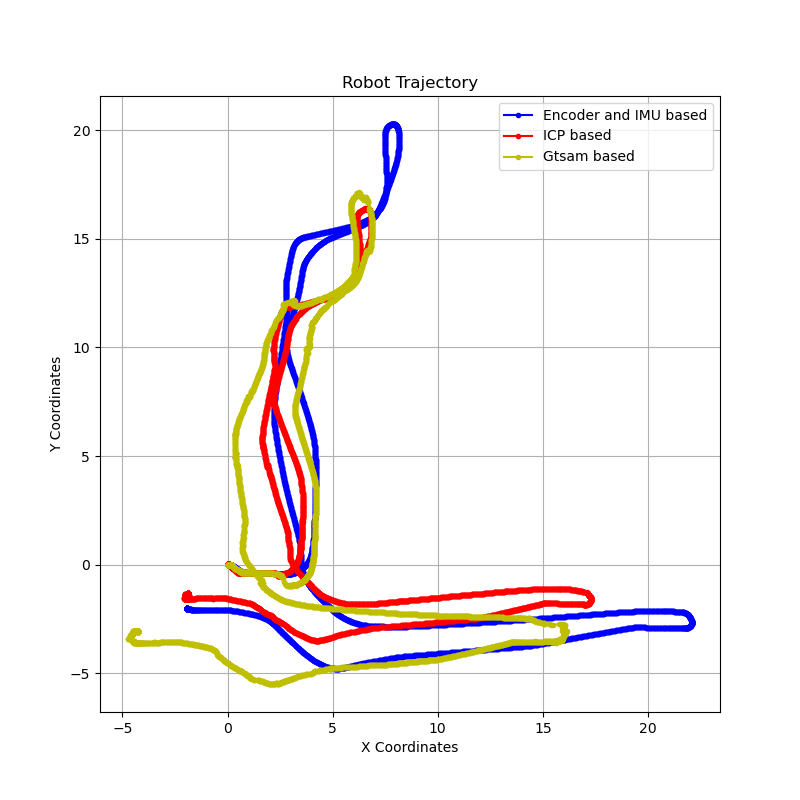
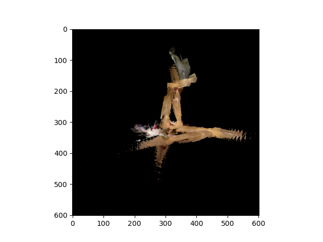
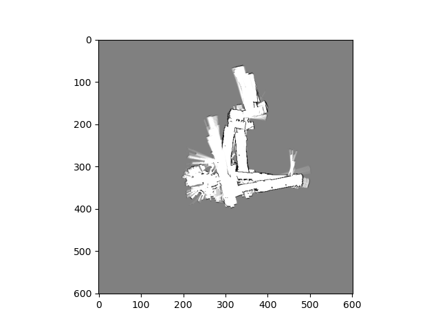
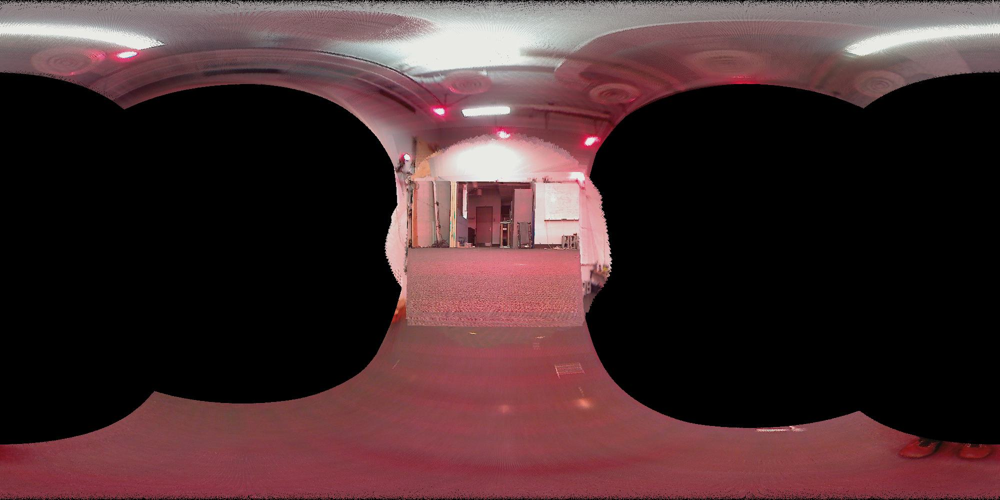
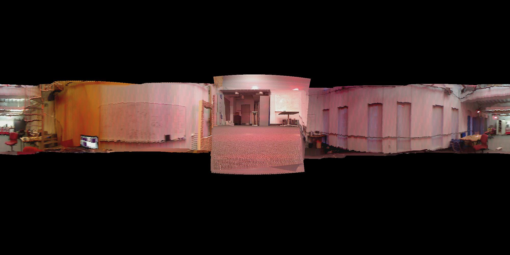
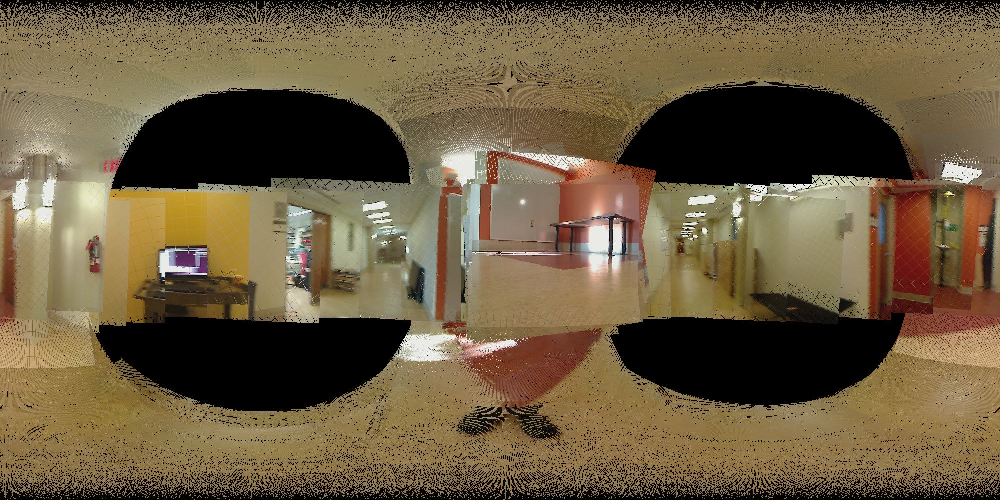
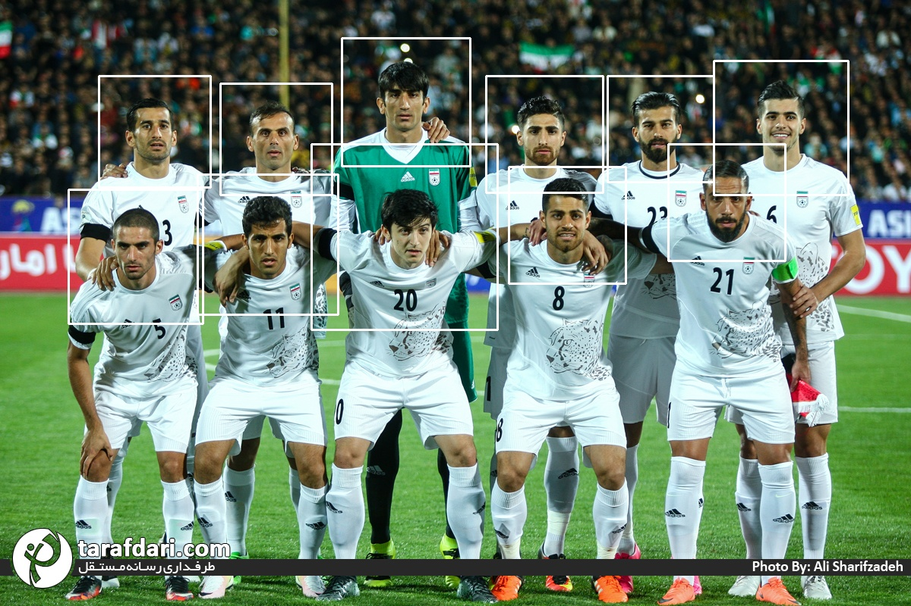
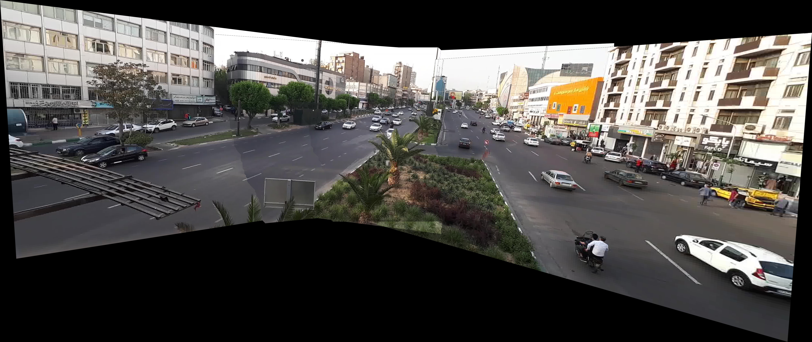
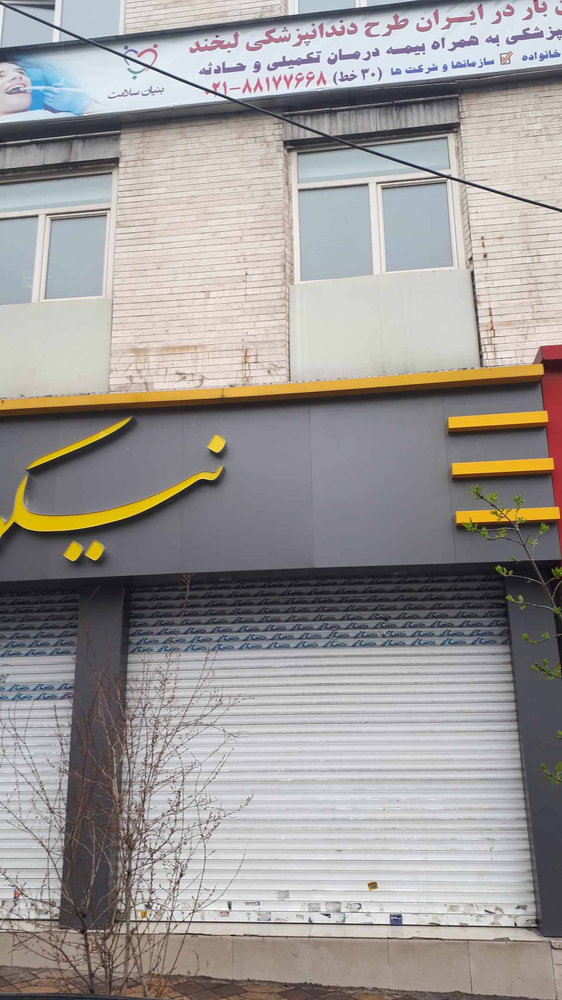
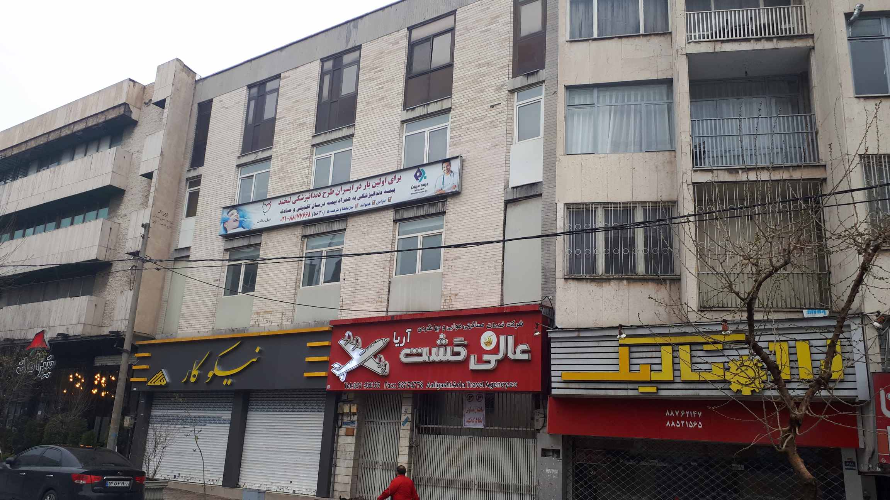



## **LiDAR-Based SLAM ([Link](https://github.com/Amirhosein-javadi/UCSD-Courses/tree/main/ECE276/PR2))**
Our project focused on the development of a LiDAR-based Simultaneous Localization and Mapping (SLAM) system tailored for a differential-drive robot. By integrating encoder and IMU odometry with 2-D LiDAR scans and RGBD measurements, along with the powerful optimization capabilities of GTSAM, we engineered a comprehensive solution to accurately localize the robot in its environment while simultaneously mapping its surroundings.

Utilizing a combination of sensor data, our system constructs a detailed 2-D occupancy grid map, providing valuable insights into the robot's surroundings and enhancing spatial understanding. Moreover, we employed RGBD images to add color information to the map, further enriching its visual representation and aiding in navigation tasks.

Through rigorous testing and validation, we ensured the reliability and accuracy of our SLAM system, making it suitable for real-world applications where precise localization and mapping are crucial. The incorporation of GTSAM optimization enhances the robustness and efficiency of our system, allowing for more accurate and reliable mapping and localization results.

  
  
  
  <em>ٍ Estimated Trajectory and Corresponding Texture and Occupancy Maps </em>

## **Orientation Tracking ([Link](https://github.com/Amirhosein-javadi/UCSD-Courses/tree/main/ECE276/PR1))**
Our project is centered around the precise tracking of object orientation using data gathered from Inertial Measurement Units (IMUs). We've devised a methodology that leverages IMU measurements to accurately determine the three-dimensional orientation of objects as they rotate. Going beyond simple orientation tracking, our approach extends to generating panoramic images of the object's surroundings. This added functionality greatly enhances spatial perception and visualization, making it particularly valuable in fields like robotics and virtual reality.

By integrating IMU data with camera images captured from the rotating object, we're able to stitch together comprehensive visual representations of the environment. This not only provides valuable insights into the object's orientation but also offers a richer understanding of its surroundings.

We've conducted extensive validation exercises, comparing our orientation tracking results against ground truth data from VICON motion capture systems. These tests ensure the reliability and accuracy of our tracking algorithm, making it suitable for a wide range of real-world applications.

  
  
  

## **Breakout game with Reinforcement Learning ([Link](https://github.com/Amirhosein-javadi/Artificial-Intelligence-Homeworks/tree/main/HW5/Breakout_RL))**
In this project, I embarked on the journey of implementing a Deep-Q-Network (DQN), a fundamental algorithm in reinforcement learning, and applied it to an Atari game within the OpenAI Gym environment. The game scenario involved controlling a spaceship capable of shooting bullets, with the objective being to evade or destroy incoming meteors colored in red.

The gameplay dynamics were dynamic and challenging, requiring strategic decision-making at each frame. The spaceship could perform three actions: move up, move down, or remain still. Meanwhile, red-colored meteors periodically appeared on the screen, posing imminent threats to the spaceship. To neutralize these threats, the spaceship had to shoot each meteor three times, with each shot changing the meteor's color from red to orange to yellow until it vanished.

Through the implementation and training of the DQN, I aimed to teach the spaceship agent optimal decision-making strategies to survive and maximize its score in the game environment. By iteratively learning from its interactions with the game environment, the DQN gradually improved its ability to navigate the game space, evade incoming meteors, and efficiently destroy them to ensure survival.

  

## **Face Detection Using HOG ([Link](https://github.com/Amirhosein-javadi/Face-Detection-Using-HOG-Computer-Vision))**
In this project, I implemented a Face Detection model using the Histogram of Oriented Gradients (HOG) descriptor, a powerful feature descriptor widely employed in computer vision and image processing for object detection tasks. The HOG technique involves counting occurrences of gradient orientation within localized regions of an image, allowing for robust detection of objects.

To accomplish this, I developed a model that utilizes the HOG descriptor to analyze images and detect faces within them. By leveraging the distinctive patterns captured by the HOG features, our model can accurately identify facial regions within images.

Throughout the project, I experimented with various parameters and configurations to optimize the performance of the face detection model. This involved fine-tuning parameters such as cell size, block size, and the number of bins in the histogram to achieve the best results.

Once the model was trained and validated, I ran it with a set of test images to evaluate its performance in real-world scenarios. By analyzing the detection results and assessing metrics such as precision, recall, and accuracy, I assessed the effectiveness of the face detection model.

  

## **Panorama and Video Processing ([Link](https://github.com/Amirhosein-javadi/Panorama-and-Video-Processing-Computer-Vision))**
In this project, I gained hands-on experience in creating panoramas from video footage consisting of five keyframes. The provided video captures a bustling boulevard teeming with moving cars and pedestrians, while the camera undergoes a horizontal rotation.

Utilizing image processing techniques, I successfully extracted both the background and foreground elements from each frame of the video. This process involved carefully separating stationary background elements from the dynamic foreground objects, such as cars and pedestrians, to achieve a clear distinction between the two.

Furthermore, I stitched together the five keyframes to generate a panoramic view of the scene. This panoramic image offers a comprehensive and seamless representation of the boulevard, capturing the dynamic movement and intricate details of the environment.

  

- [Background video](https://www.youtube.com/watch?v=Qnf5Q8QWu5I)
- [Foreground video](https://www.youtube.com/watch?v=N1XlOWRwfXo)

## **Perspective Transformation with Homography ([Link](https://github.com/Amirhosein-javadi/Computer-Vision-Homework/tree/main/HW1/RANSAC%20and%20Sift))**
In this project, I delved into the realm of computer vision by implementing the perspective transform with homography, incorporating RANSAC (Random Sample Consensus) and SIFT (Scale-Invariant Feature Transform) algorithms. These techniques are instrumental in accurately aligning and transforming images taken from different perspectives.

Using the implemented algorithm, I applied perspective transformation to a pair of photos, seamlessly aligning them to create a cohesive visual representation. This process involved identifying corresponding points in both images, estimating the homography matrix using RANSAC to mitigate outliers, and applying the transformation to achieve proper alignment.

  
  
  

## **Poisson Blending ([Link](https://github.com/Amirhosein-javadi/Image-Processing-Homework/tree/main/HW5/Poisson%20Blending))**
In this project, I undertook the implementation of the Poisson Blending algorithm from scratch, a sophisticated technique widely used in image processing for seamless blending of objects into complex backgrounds. This algorithm leverages the principles of partial differential equations to achieve smooth and natural transitions between the inserted object and the background.

Applying my implemented algorithm, I seamlessly integrated an airplane into the sky image, ensuring that the insertion appeared realistic and visually pleasing. By carefully adjusting the blending parameters and fine-tuning the algorithm, I achieved a harmonious fusion between the airplane and the sky, effectively concealing any noticeable seams or artifacts.

  
  
  

