# **Current Projects**

### **Nash in CycleGAN**
In a paper named [GANs May Have No Nash Equilibria](https://arxiv.org/pdf/2002.09124.pdf), it is shown that WGAN-WC, WGAN-GP, and SNGAN may have no nash equilibrium. It means that after training the Generator and Discriminator for some iterations, the pair (G_final, D_final) does not represent a Nash equilibrium. It means that by fixing the trained discriminator and optimizing the generator, the generator will change. In my research project, I showed that Nash equilibrium is viable in the [CycleGAN](https://arxiv.org/pdf/1703.10593.pdf) paradigm theoretically and by simulations. 

### **Depth Estimation in Surgical Rooms**
In this project, I am trying to create a depth estimation in surgical room with 6 cameras. My final goal is to predict depth accurately and create a 3d model of our room. Some of my current network results are shown below. (From Left to Right: Input Image, Ground Truth, Predicted Inverse Depth)

  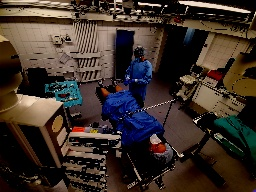
  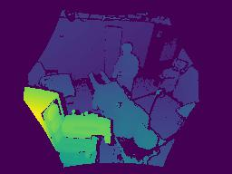
  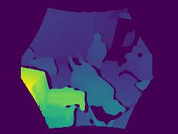

  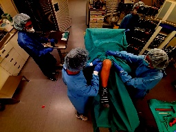
  
  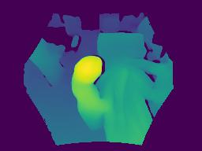

  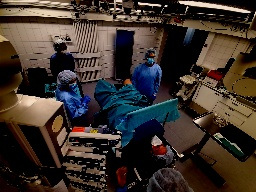
  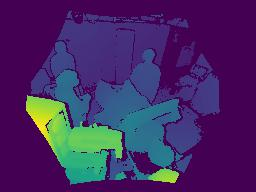
  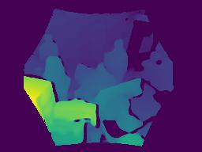

  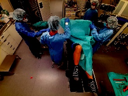
  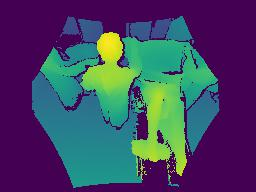
  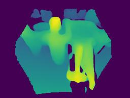
 

 
### **Liver Tumor Segmentation**
In this project, I am working on a neural network for liver tumor segmentation over LiTS17 datasets. My ultimate goal is to have +95% dice score. Some of my current network results are shown below. (From Left to Right: Input Image, Ground Truth, Model Output) 

  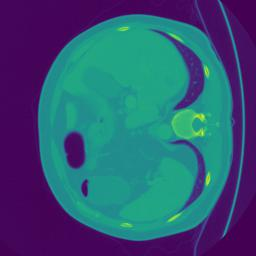
  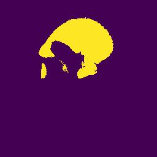
  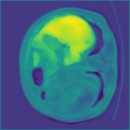

  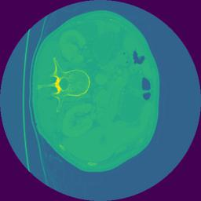
  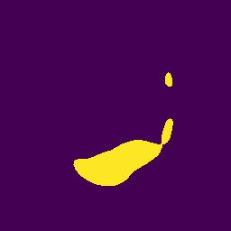
  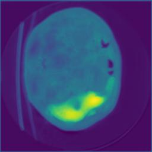

  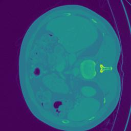
  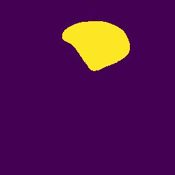
  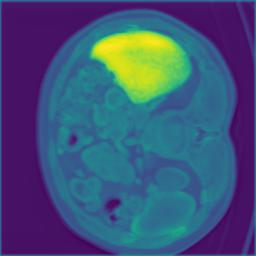

  
  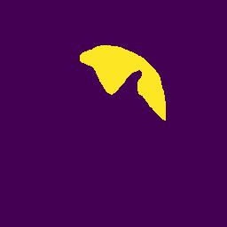
  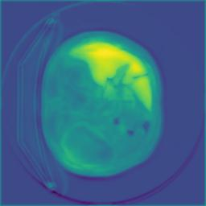

# **Previous Projects**
### **SEFDM Communication**
