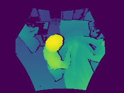
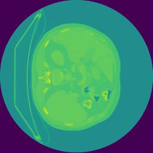

# **Current Projects**

### **Nash in CycleGAN**
In my research project, I investigated the viability of Nash equilibrium in the context of CycleGAN, a popular generative adversarial network (GAN) architecture. Unlike previous studies, ([GANs May Have No Nash Equilibria](https://arxiv.org/pdf/2002.09124.pdf)), highlighting the potential absence of Nash equilibria in certain GAN variants such as WGAN-WC, WGAN-GP, and SNGAN, I focused on demonstrating the existence and stability of Nash equilibria in the CycleGAN paradigm.

Drawing upon theoretical analyses and extensive simulations, I provided evidence supporting the claim that Nash equilibria are indeed achievable and sustainable within the CycleGAN framework. By analyzing the dynamics of the generator and discriminator interactions, I showed that the trained generator and discriminator pairs converge to a Nash equilibrium state, wherein neither party can unilaterally improve its performance without adversely affecting the other.

Overall, my findings provide a contrasting perspective to previous studies and underscore the potential for Nash equilibria to manifest in GAN frameworks, particularly in the context of CycleGAN, thereby advancing the discourse on equilibrium analysis in generative adversarial networks.

### **Depth Estimation in Surgical Rooms**
In this project, my objective is to develop a depth estimation system tailored specifically for surgical rooms, utilizing data from six cameras strategically positioned within the environment. The ultimate aim is to accurately predict depth information and generate a comprehensive 3D model of the surgical room.

By leveraging advanced machine learning techniques and optimizing the network architecture, I aim to enhance the accuracy and robustness of depth predictions. Additionally, I plan to integrate the predicted depth information from multiple camera viewpoints to construct a detailed and precise 3D representation of the surgical room.

This project holds immense potential for revolutionizing surgical procedures by providing surgeons with enhanced spatial awareness and depth perception during operations. 

  
  
  

  
  
  

  
  
  

  
  
  
 

 
### **Liver Tumor Segmentation**
In this project, I've been dedicated to refining a neural network tailored for liver tumor segmentation using the LiTS17 dataset. My primary objective is to attain a Dice score exceeding 95%, indicating exceptional accuracy in delineating liver tumors from medical images.

The provided network results showcase significant progress towards this goal. Displayed from left to right are the input image, ground truth segmentation, and the output generated by my model. These visualizations offer a clear indication of the network's performance in accurately identifying liver tumors within medical images.

I've achieved a remarkable Dice score of 93%. Notably, this score is only 3% lower than the current state-of-the-art, while simultaneously reducing the model size by nearly 10-fold.

The implementation of a lightweight U-Net architecture has been instrumental in this achievement, enabling efficient yet highly accurate tumor segmentation. This accomplishment signifies a significant advancement in medical image analysis, with potential implications for improving diagnostic accuracy and patient care.

  
  
  

  
  
  

  
  
  

  
  
  

